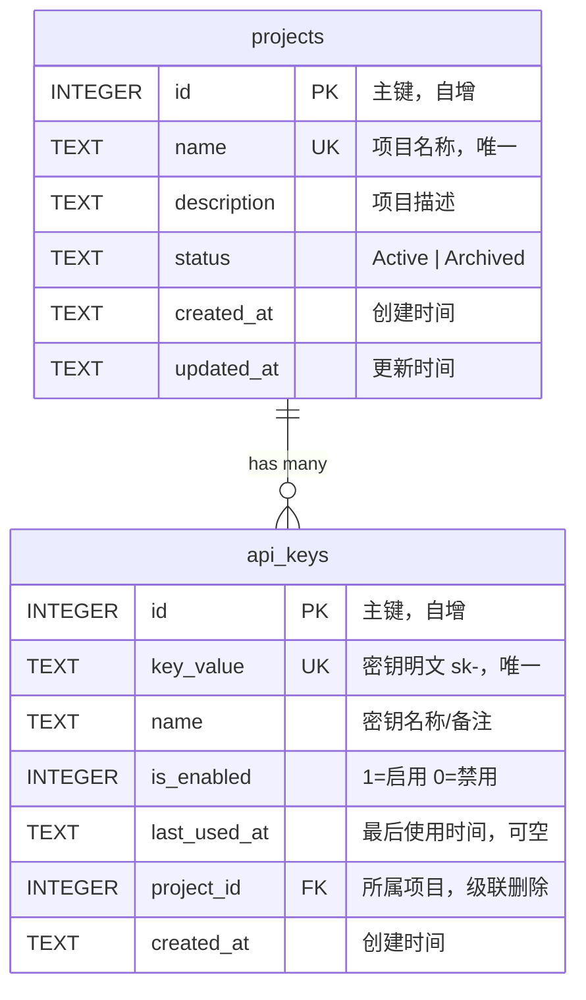
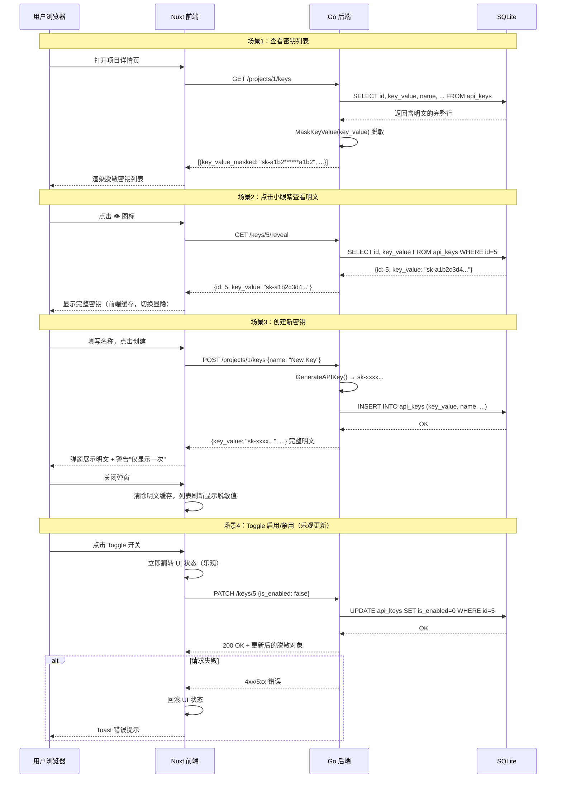

# Dev Portal — 设计文档

> 本文档是 API 契约与数据模型的权威来源。前后端实现均以此为准。

## 1. ER 图



### 关系说明

| 关系 | 描述 |
|------|------|
| `projects` 1 → N `api_keys` | 一个项目拥有多个密钥 |
| 级联删除 | `api_keys.project_id` 设置 `ON DELETE CASCADE`，删除项目时自动删除其下所有密钥 |

## 2. DDL（SQLite）

```sql
PRAGMA foreign_keys = ON;

CREATE TABLE IF NOT EXISTS projects (
    id          INTEGER PRIMARY KEY AUTOINCREMENT,
    name        TEXT    NOT NULL UNIQUE,
    description TEXT    NOT NULL DEFAULT '',
    status      TEXT    NOT NULL DEFAULT 'Active' CHECK (status IN ('Active', 'Archived')),
    created_at  TEXT    NOT NULL DEFAULT (datetime('now')),
    updated_at  TEXT    NOT NULL DEFAULT (datetime('now'))
);

CREATE TABLE IF NOT EXISTS api_keys (
    id           INTEGER PRIMARY KEY AUTOINCREMENT,
    key_value    TEXT    NOT NULL UNIQUE,
    name         TEXT    NOT NULL,
    is_enabled   INTEGER NOT NULL DEFAULT 1,
    last_used_at TEXT,
    project_id   INTEGER NOT NULL REFERENCES projects(id) ON DELETE CASCADE,
    created_at   TEXT    NOT NULL DEFAULT (datetime('now'))
);

CREATE INDEX IF NOT EXISTS idx_api_keys_project_id ON api_keys(project_id);
```

## 3. API 接口设计

基础路径：`http://localhost:7080`

所有请求/响应 Content-Type 为 `application/json`。

---

### 3.1 GET /projects

获取所有项目列表（含密钥数量统计）。

**请求**：无 body

**响应** `200 OK`：

```jsonc
// Array<ProjectWithCount>
[
  {
    "id": 1,
    "name": "Cloud Platform",
    "description": "Cloud infrastructure management",
    "status": "Active",
    "key_count": 4,
    "created_at": "2026-02-25T10:00:00Z",
    "updated_at": "2026-02-25T10:00:00Z"
  }
]
```

**后端实现**：LEFT JOIN `api_keys` 统计 `key_count`。

---

### 3.2 POST /projects

创建新项目。

**请求** body：

```jsonc
{
  "name": "My App",         // 必填，唯一
  "description": "optional"  // 可选，默认空串
}
```

**响应** `201 Created`：

```jsonc
// Project
{
  "id": 3,
  "name": "My App",
  "description": "optional",
  "status": "Active",
  "key_count": 0,
  "created_at": "2026-02-25T12:00:00Z",
  "updated_at": "2026-02-25T12:00:00Z"
}
```

**错误**：

| 状态码 | 条件 | 响应 |
|--------|------|------|
| 400 | `name` 为空 | `{"error": "name is required"}` |
| 400 | `name` 已存在 | `{"error": "project name already exists"}` |

---

### 3.3 GET /projects/:id

获取单个项目详情。

**响应** `200 OK`：

```jsonc
// Project
{
  "id": 1,
  "name": "Cloud Platform",
  "description": "Cloud infrastructure management",
  "status": "Active",
  "key_count": 4,
  "created_at": "2026-02-25T10:00:00Z",
  "updated_at": "2026-02-25T10:00:00Z"
}
```

**错误**：

| 状态码 | 条件 | 响应 |
|--------|------|------|
| 404 | 项目不存在 | `{"error": "project not found"}` |

---

### 3.4 PATCH /projects/:id

部分更新项目信息。所有字段均为可选，仅更新传入的字段。

**请求** body：

```jsonc
{
  "name": "Renamed",           // 可选
  "description": "new desc",   // 可选
  "status": "Archived"         // 可选，仅 "Active" | "Archived"
}
```

**响应** `200 OK`：返回更新后的完整 Project 对象（同 GET /projects/:id）。

**错误**：

| 状态码 | 条件 | 响应 |
|--------|------|------|
| 400 | body 为空或无有效字段 | `{"error": "no fields to update"}` |
| 400 | `status` 值非法 | `{"error": "invalid status, must be Active or Archived"}` |
| 400 | `name` 已被占用 | `{"error": "project name already exists"}` |
| 404 | 项目不存在 | `{"error": "project not found"}` |

---

### 3.5 DELETE /projects/:id

删除项目及其下所有密钥（级联删除）。

**请求**：无 body

**响应** `204 No Content`：无 body

**错误**：

| 状态码 | 条件 | 响应 |
|--------|------|------|
| 404 | 项目不存在 | `{"error": "project not found"}` |

---

### 3.6 GET /projects/:id/keys

获取某项目下的所有密钥。**密钥值脱敏返回**，不包含明文字段。

**响应** `200 OK`：

```jsonc
// Array<ApiKeyMasked>
[
  {
    "id": 1,
    "key_value_masked": "sk-a1b2******o5p6",
    "name": "Production Key",
    "is_enabled": true,
    "last_used_at": null,
    "project_id": 1,
    "created_at": "2026-02-25T10:00:00Z"
  }
]
```

> **安全**：响应中没有 `key_value` 字段。脱敏规则见第 4 节。

**错误**：

| 状态码 | 条件 | 响应 |
|--------|------|------|
| 404 | 项目不存在 | `{"error": "project not found"}` |

---

### 3.7 POST /projects/:id/keys

为项目生成一个新密钥。密钥由后端生成，**仅在创建响应中返回一次明文**。

**请求** body：

```jsonc
{
  "name": "Production Key"  // 必填，密钥备注名
}
```

**响应** `201 Created`：

```jsonc
// ApiKeyFull — 包含明文，仅此一次
{
  "id": 5,
  "key_value": "sk-a1b2c3d4e5f6a1b2c3d4e5f6a1b2c3d4e5f6a1b2c3d4e5f6a1b2c3d4e5f6a1b2",
  "name": "Production Key",
  "is_enabled": true,
  "last_used_at": null,
  "project_id": 1,
  "created_at": "2026-02-25T12:00:00Z"
}
```

**错误**：

| 状态码 | 条件 | 响应 |
|--------|------|------|
| 400 | `name` 为空 | `{"error": "name is required"}` |
| 404 | 项目不存在 | `{"error": "project not found"}` |

---

### 3.8 PATCH /keys/:id

更新密钥状态（启用/禁用）。

**请求** body：

```jsonc
{
  "is_enabled": false  // 必填，boolean
}
```

**响应** `200 OK`：

```jsonc
// ApiKeyMasked — 脱敏
{
  "id": 5,
  "key_value_masked": "sk-a1b2******o5p6",
  "name": "Production Key",
  "is_enabled": false,
  "last_used_at": null,
  "project_id": 1,
  "created_at": "2026-02-25T12:00:00Z"
}
```

**错误**：

| 状态码 | 条件 | 响应 |
|--------|------|------|
| 400 | body 缺少 `is_enabled` | `{"error": "is_enabled is required"}` |
| 404 | 密钥不存在 | `{"error": "api key not found"}` |

---

### 3.9 DELETE /keys/:id

删除单个密钥。

**请求**：无 body

**响应** `204 No Content`：无 body

**错误**：

| 状态码 | 条件 | 响应 |
|--------|------|------|
| 404 | 密钥不存在 | `{"error": "api key not found"}` |

---

### 3.10 GET /keys/:id/reveal

获取单个密钥的完整明文。前端点击"小眼睛"时调用。

**请求**：无 body

**响应** `200 OK`：

```jsonc
// ApiKeyRevealed — 仅返回 id 和明文
{
  "id": 5,
  "key_value": "sk-a1b2c3d4e5f6a1b2c3d4e5f6a1b2c3d4e5f6a1b2c3d4e5f6a1b2c3d4e5f6a1b2"
}
```

**错误**：

| 状态码 | 条件 | 响应 |
|--------|------|------|
| 404 | 密钥不存在 | `{"error": "api key not found"}` |

---

### 3.11 接口总览

| # | 方法 | 路径 | 说明 | 响应码 |
|---|------|------|------|--------|
| 1 | GET | `/projects` | 项目列表 | 200 |
| 2 | POST | `/projects` | 创建项目 | 201 |
| 3 | GET | `/projects/:id` | 项目详情 | 200 |
| 4 | PATCH | `/projects/:id` | 更新项目 | 200 |
| 5 | DELETE | `/projects/:id` | 删除项目（级联） | 204 |
| 6 | GET | `/projects/:id/keys` | 密钥列表（脱敏） | 200 |
| 7 | POST | `/projects/:id/keys` | 创建密钥 | 201 |
| 8 | PATCH | `/keys/:id` | 切换密钥状态 | 200 |
| 9 | DELETE | `/keys/:id` | 删除密钥 | 204 |
| 10 | GET | `/keys/:id/reveal` | 获取密钥明文 | 200 |

## 4. 安全设计

### 4.1 脱敏策略：后端脱敏

```
为什么选择后端脱敏而非前端脱敏？

前端脱敏：API 返回明文 → 前端 JS 处理显示 → 明文存在于网络传输和浏览器内存中
后端脱敏：API 返回脱敏值 → 明文始终留在服务端 → 前端按需通过 reveal 接口单独获取

后端脱敏将攻击面从"拦截任意列表请求"缩小到"逐个调用 reveal 接口"，
即使前端代码被注入恶意脚本，也无法从列表响应中批量窃取明文。
```

### 4.2 脱敏规则

密钥格式：`sk-` + 64 位 hex 字符（共 67 字符）

```
明文：sk-a1b2c3d4e5f6a1b2c3d4e5f6a1b2c3d4e5f6a1b2c3d4e5f6a1b2c3d4e5f6a1b2
脱敏：sk-a1b2******a1b2
规则：sk- + body[0:4] + ****** + body[-4:]
```

### 4.3 Reveal 接口安全说明

当前版本（内部工具 MVP）不对 reveal 接口做鉴权或速率限制。生产环境应考虑：
- 添加审计日志，记录谁在什么时间查看了哪个密钥的明文
- 对 reveal 接口做速率限制，防止批量遍历
- 接入认证体系后按角色控制 reveal 权限

### 4.4 密钥生成

```
算法：crypto/rand → 32 bytes → hex encode → "sk-" 前缀
格式：sk-<64 hex chars>
长度：67 字符
熵值：256 bit（加密安全随机数）
```

### 4.5 数据流



## 5. TypeScript 类型定义

供前端 `apps/web/app/types/index.ts` 使用：

```typescript
/** 项目 */
export interface Project {
  id: number
  name: string
  description: string
  status: 'Active' | 'Archived'
  key_count: number
  created_at: string
  updated_at: string
}

/** 创建/更新项目的请求体 */
export interface ProjectInput {
  name?: string
  description?: string
  status?: 'Active' | 'Archived'
}

/** 密钥（脱敏，列表接口返回） */
export interface ApiKeyMasked {
  id: number
  key_value_masked: string
  name: string
  is_enabled: boolean
  last_used_at: string | null
  project_id: number
  created_at: string
}

/** 密钥（完整明文，创建接口返回） */
export interface ApiKeyFull {
  id: number
  key_value: string
  name: string
  is_enabled: boolean
  last_used_at: string | null
  project_id: number
  created_at: string
}

/** 密钥明文（reveal 接口返回） */
export interface ApiKeyRevealed {
  id: number
  key_value: string
}

/** 通用错误响应 */
export interface ApiError {
  error: string
}
```

## 6. Go Struct 定义

供后端 `apps/api/internal/model/model.go` 使用：

```go
package model

import "time"

type Project struct {
    ID          int64     `json:"id"`
    Name        string    `json:"name"`
    Description string    `json:"description"`
    Status      string    `json:"status"`
    KeyCount    int       `json:"key_count"`
    CreatedAt   time.Time `json:"created_at"`
    UpdatedAt   time.Time `json:"updated_at"`
}

type ApiKey struct {
    ID             int64      `json:"id"`
    KeyValue       string     `json:"key_value,omitempty"`
    KeyValueMasked string     `json:"key_value_masked,omitempty"`
    Name           string     `json:"name"`
    IsEnabled      bool       `json:"is_enabled"`
    LastUsedAt     *time.Time `json:"last_used_at"`
    ProjectID      int64      `json:"project_id"`
    CreatedAt      time.Time  `json:"created_at"`
}

type ApiKeyRevealed struct {
    ID       int64  `json:"id"`
    KeyValue string `json:"key_value"`
}
```

序列化策略：
- `Project.KeyCount` 始终输出（包括值为 0 的情况），不使用 `omitempty`
- `ApiKey` 同时包含 `KeyValue` 和 `KeyValueMasked`，通过 `omitempty` 控制输出
- 列表接口：仅填充 `KeyValueMasked`，`KeyValue` 保持零值（不输出）
- 创建接口：仅填充 `KeyValue`，`KeyValueMasked` 保持零值（不输出）
- Reveal 接口：使用独立的 `ApiKeyRevealed` 结构

## 7. 预置数据（Seed）

| 项目 | 状态 | 密钥名称 | 启用 |
|------|------|----------|------|
| Cloud Platform | Active | Production Key | true |
| Cloud Platform | Active | Staging Key | true |
| Cloud Platform | Active | Legacy Key | false |
| Cloud Platform | Active | Testing Key | true |
| Mobile App | Active | iOS Key | true |
| Mobile App | Active | Android Key | true |
| Mobile App | Active | Deprecated Key | false |

密钥值由 `GenerateAPIKey()` 在 seed 时动态生成，每次初始化数据库得到不同的密钥。
